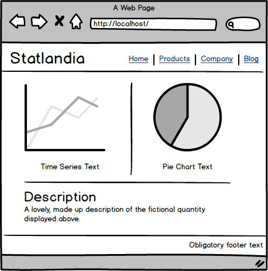

Statlandia
==========

The goal of this exercise to create a real time statistics portal with two constantly updating graphs. A suggested layout is provided below for inspiration, but need not be followed. The first graph is a time series view of a fictional quanity for a 60 second window.  The second graph is a pie chart view of the sub-totals over all time.

The data required for both these graphs can be found using the API locations **/data/time_series** and **/data/pie_chart**. The data source is updated periodically at 4 times a second.  Feel free to bring any libraries or frameworks you need to make this page look good.

The final result should be a compressed directory that, when unpacked, can be viewed using the provided node.js script. Place anything you wish to serve such as javascript or css in the **/public** directory.  To test, install node.js, the node packaga manager **npm**, install the dependencies **npm install**, run the node script **node statlandia.js**, and view the webpage at **localhost:8000/**. Have fun!

